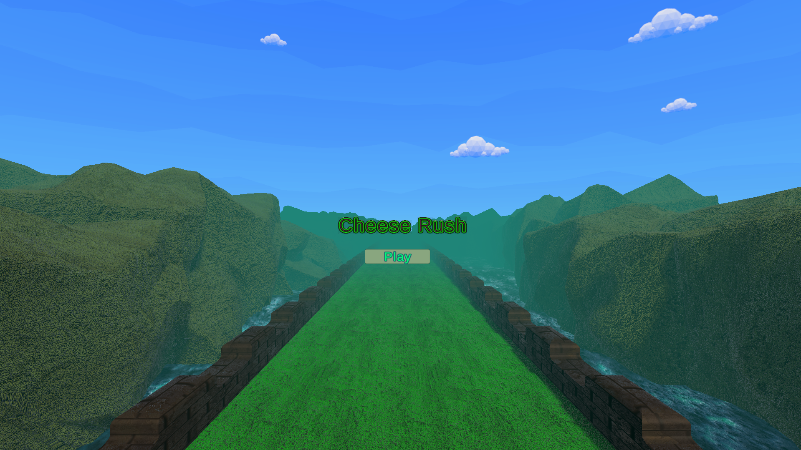
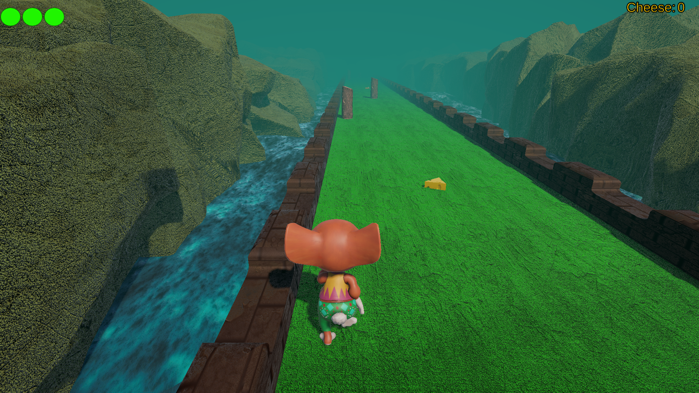
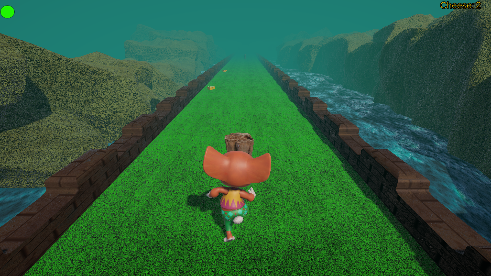
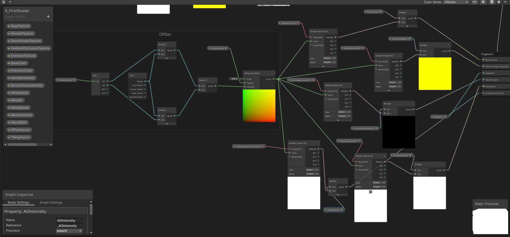
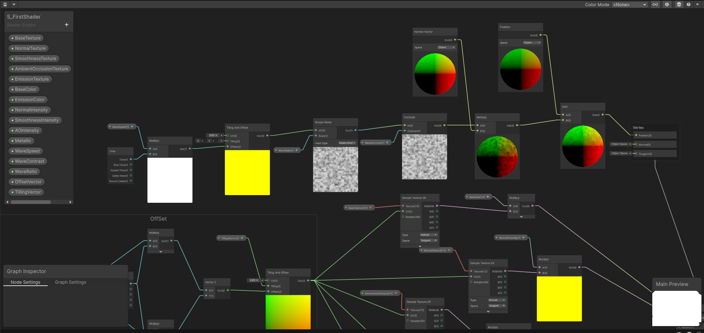

# 🧀 Cheese Rush

[](https://unity.com/)
[](https://play.unity.com)
[](LICENSE)

A fast-paced 3D endless runner game built with **Unity 6**. Guide a little mouse through a misty canyon, collect as much cheese as you can and dodge the wooden obstacles blocking your path!

🎮 **[Play the Game in Your Browser (Unity Play)](https://play.unity.com/api/v1/games/game/8a0d41a9-8ddb-4fc0-81a2-b4486f2f2a8e/build/latest/frame)**

---

## 📸 Screenshots

| Main Menu | Gameplay | Obstacle |
| :---: | :---: | :---: |
|  |  |  |

---

## ✨ Features

- **State-Driven Character Mechanics:** Character behavior is controlled with Animator triggers and Rigidbody physics.
- **Dynamic Terrain Recycling:** Terrain segments are reused instead of constantly instantiated, which reduces memory load and keeps gameplay smooth.
- **Collectibles & Obstacles:** Collect cheese to raise your score and avoid wooden obstacles along the track.
- **Health Indicator:** Remaining health is shown on screen during the run.
- **Custom Water Shader (Shader Graph):** Animated wave effect for the water surface, built visually with node graphs (no code).
- **Audio System:** Sound effects and music handled through a central AudioManager.
- **WebGL Build:** Playable directly in the browser via Unity Play.

---

## 🌊 Water Shader (Shader Graph)

The water surface uses a custom shader built with Unity's **Shader Graph**, without writing any shader code.

- **Vertex stage (wave motion):** A time-driven UV offset feeds a Simple Noise node. Its contrast is adjusted, multiplied with the surface normal and added to the vertex position, which makes the surface wave.
- **Fragment stage (surface look):** Base color, normal, smoothness, ambient occlusion, emission and metallic inputs are sampled with a scrolling UV, so the water appears to flow.
- **Exposed properties:** `WaveSpeed`, `WaveContrast`, `WaveRatio`, `OffsetVector`, `TilingVector` and intensity controls for normal, smoothness and AO, all adjustable from the material.

| Vertex Stage | Fragment Stage |
| :---: | :---: |
|  |  |

---

## 🕹️ Controls

| Action | Key / Input |
| ------ | ----------- |
| **Move Left / Right** | `A` / `D` or `Left` / `Right` Arrow Keys |
| **Jump** | `Spacebar` |

---

## 🛠️ Tech Stack & Assets

- **Engine:** Unity 6.3 LTS (6000.3.2f1)
- **Language:** C#
- **Input System:** Legacy Input Manager
- **Graphics:** Shader Graph
- **Assets & Packages:**
  * Character & animations: [Mixamo](https://www.mixamo.com/) — Mousey
  * Environment design: Unity Asset Store
  * Skybox: [FREE Skybox Extended Shader](https://assetstore.unity.com/packages/vfx/shaders/free-skybox-extended-shader-107400) by BOXOPHOBIC

---

## 📁 Project Structure

```
Assets/
├── Development/
│   ├── Animations/
│   ├── Materials/
│   ├── Models/
│   ├── PhysicMaterials/
│   ├── Prefabs/
│   ├── Scenes/      → S_MainMenu, S_RunnerScene
│   ├── Scripts/
│   ├── Shaders/
│   ├── Sound/
│   └── Texture/
└── BOXOPHOBIC/      → Skybox Cubemap Extended
```

---

## 🚀 Getting Started (Local Setup)

1. **Clone the repository:**
```
   git clone https://github.com/emirsumer/CheeseRush.git
```
2. **Open with Unity:** Add the folder in Unity Hub and use Unity 6000.3.2f1 (or a compatible Unity 6 version).
3. **Run the Game:** Open `Assets/Development/Scenes/S_MainMenu.unity` and press **Play**.

---

## 🙏 Credits

- The environment structure and the skybox setup were created by following my instructor's guidance.
- Character and animations from Mixamo; environment and skybox assets from the Unity Asset Store.

## 📜 License

This project is open-source and available under the MIT License.
